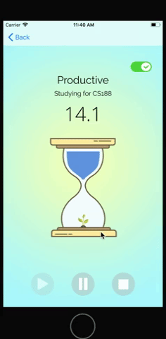

# Hourglass

## Introduction
Hourglass is a productivity timer that encourages productivity by allowing users to "grow trees" after 30 minutes of uninterrupted productivity.

## Installation
You can pull the Hourglass repo to access Hourglass.xcworkspace and run the project on your local computer. Hourglass is currently being improved before releasing to the App Store.

